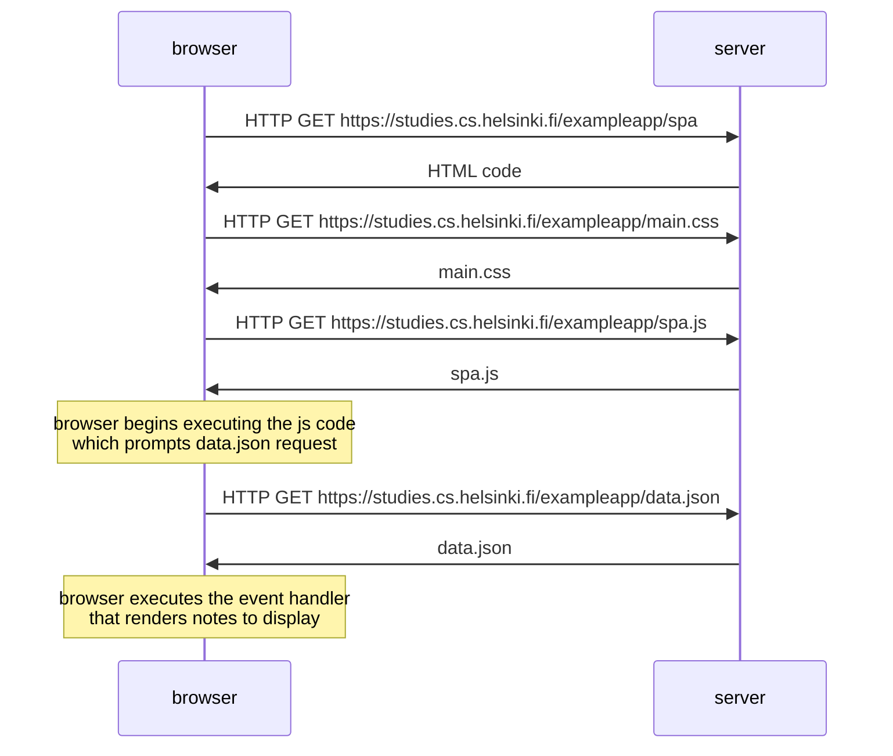

```mermaid
  sequenceDiagram
    participant browser
    participant server
    browser->>server: HTTP GET https://studies.cs.helsinki.fi/exampleapp/spa
    server->>browser: HTML code
    browser->>server: HTTP GET https://studies.cs.helsinki.fi/exampleapp/main.css
    server->>browser: main.css
    browser->>server: HTTP GET https://studies.cs.helsinki.fi/exampleapp/spa.js
    server->>browser: spa.js
    
    Note over browser: browser begins executing the js code <br/> which prompts data.json request
    
    browser->>server: HTTP GET https://studies.cs.helsinki.fi/exampleapp/data.json
    server->>browser: data.json 
    
    Note over browser: browser executes the event handler <br/> that renders notes to display
    
    
    

    
  
```
